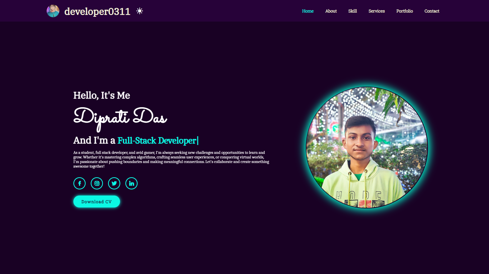

# **🚀 Portfolio Website**

## 🌙 Dark Mode Preview



## ☀️ Light Mode Preview


## 🌍 Live Demo

🔗 [**View Portfolio**](https://developer0311.github.io/portfolio/)

## 📂 Repository

📌 [**GitHub Repository**](https://github.com/developer0311/portfolio)

## 📌 About the Project

This is a **personal portfolio website** showcasing my skills, projects, and services. It is fully **responsive**, designed with a **modern UI**, and features both **light and dark mode** for a better user experience.

## ✨ Features

✅ **📱 Responsive Design** – Works across all devices  
✅ **🖥️ Home, About, Skills, Services, Portfolio, and Contact Sections**  
✅ **🌗 Light & Dark Mode Toggle**  
✅ **🎭 Smooth Scroll Animations** (Powered by [ScrollReveal](https://unpkg.com/scrollreveal))  
✅ **⌨️ Dynamic Typing Effect** (Using [Typed.js](https://unpkg.com/typed.js@2.1.0/dist/typed.umd.js))  
✅ **📥 Download CV Button**  
✅ **📩 Contact Form Submission** (Integrated with [Formspree](https://formspree.io/))

## 🛠️ Technologies Used

- **💻 HTML, CSS, JavaScript**
- **🎨 Boxicons** – For adding modern and lightweight icons
- **📜 ScrollReveal.js** – For smooth scrolling animations
- **✍️ Typed.js** – For text animation effects
- **📧 Formspree** – For contact form submission

## 📜 Setup & Usage

1. 🖥️ **Clone the repository**:
   ```bash
   git clone https://github.com/developer0311/portfolio.git
   ```
2. 🌍 **Open `index.html` in a browser**.
3. 🎨 **Modify content in HTML/CSS as needed**.

## 😵‍💫 Challenges I Faced

Building this portfolio was an exciting yet challenging task. My main goal was to create a **user-friendly interface** with a smooth **user experience (UX)**.

### 🔍 **Key Challenges & Solutions:**

1️⃣ **Choosing the Right Technologies**

- I often look for existing solutions (frameworks, libraries, and tools) to enhance efficiency.
- **Advantage**: Less code, faster development, and better performance.

2️⃣ **Showcasing My Professional Skills**

- The **Skills Section** was challenging because I wanted to represent my expertise in a visually appealing way.
- **Solution**: Used **animated progress bars** to make it interactive.

3️⃣ **Dark & Light Mode Implementation**

- Ensuring a seamless transition between **light and dark mode** without breaking the design.
- **Solution**: Used **CSS and JavaScript** for theme toggling.

4️⃣ **Ensuring Smooth Animations**

- Integrating animations while maintaining **performance and responsiveness**.
- **Solution**: Used **ScrollReveal.js** for smooth section transitions.

By overcoming these challenges, I learned how to balance **design, performance, and usability** while keeping the **codebase clean and maintainable**. 🚀

## 📧 Contact

📩 If you have any questions, feel free to reach out through the **Contact** section on my portfolio!
